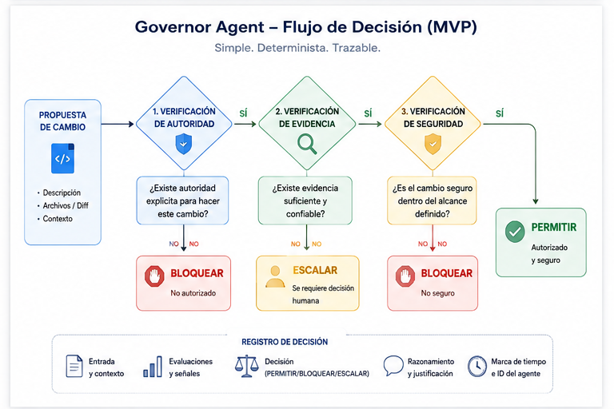
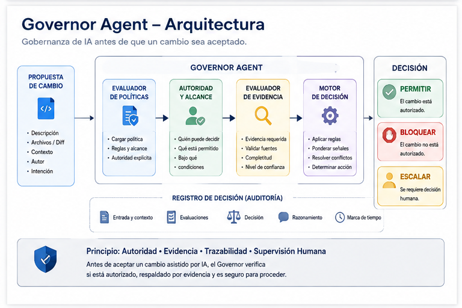

# Governor Agent

**Gobernanza para cambios de software asistidos por IA: permitir, bloquear o escalar con evidencia explícita.**

[Read in English](README.md)

Governor Agent es un nuevo proyecto open source que se está construyendo para el **Agents for Humans Hackathon**, dentro de la categoría **Professional Agents**.

Su propósito es simple:

> **Antes de aceptar un cambio de software asistido por IA, ¿puede un agente verificar si ese cambio está autorizado, respaldado por evidencia y es seguro de continuar, o si requiere una decisión humana?**

Governor Agent se implementará como un proyecto independiente utilizando **Strands Agents SDK**. No contiene implementación propietaria de GoNucleo, Living Memory ni Lexidiam.

---

## El problema

Los agentes de programación pueden modificar software a una velocidad superior a la capacidad humana de revisar cada acción en detalle.

El problema ya no es solamente generar código. También es decidir si un cambio propuesto debe permitirse.

Una capa de gobernanza útil debe poder responder preguntas como:

- ¿Este actor está autorizado para realizar este tipo de cambio?
- ¿El objetivo está dentro del alcance permitido?
- ¿Existe una política explícita que prohíba la acción?
- ¿Está disponible la evidencia de validación requerida?
- ¿La situación es suficientemente clara para decidir automáticamente?
- ¿La decisión debe escalarse a una persona?

Governor Agent explora esa capa.

---

## Modelo de decisión del MVP

El MVP del hackathon se concentra en tres resultados:

```text
Cambio de software propuesto
          ↓
     Governor Agent
          ↓
 Política + autoridad + alcance
          ↓
   Evidencia de validación
          ↓
 ┌────────┼───────────┐
 ↓        ↓           ↓
ALLOW    BLOCK     ESCALATE
 ↓        ↓           ↓
      Registro de decisión
```



### ALLOW
La propuesta está explícitamente dentro del alcance autorizado y cuenta con la evidencia requerida.

### BLOCK
La propuesta viola claramente una regla explícita o un límite de autoridad.

### ESCALATE
La propuesta no puede resolverse de forma segura usando la política y evidencia disponibles, por lo que requiere juicio humano.

---

## Escenarios de demostración

La primera versión funcional mostrará tres casos sintéticos:

1. **Cambio permitido** — modificación de bajo riesgo dentro de la autoridad declarada y con validaciones correctas.
2. **Cambio bloqueado** — propuesta que viola una política explícita o intenta modificar un objetivo protegido.
3. **Cambio escalado** — propuesta ambigua o de alto impacto que necesita aprobación humana.

El objetivo es demostrar un flujo completo y comprensible de extremo a extremo, no construir una plataforma de políticas extensa.

---

## Principios de diseño

- **Política explícita por sobre supuestos ocultos**
- **Evidencia antes de autorización**
- **Autoridad mínima necesaria**
- **Bloquear ante violaciones claras**
- **Escalar la ambigüedad en lugar de inventar permisos**
- **Responsabilidad humana en decisiones que requieren juicio**
- **Registros de decisión auditables**

---

## Arquitectura planificada

```text
Propuesta de cambio
      ↓
Strands Governor Agent
      ↓
Evaluador de políticas
      ↓
Autoridad + alcance
      ↓
Evaluador de evidencia
      ↓
Motor de decisión
      ↓
ALLOW / BLOCK / ESCALATE
      ↓
Registro de decisión legible por humanos
```



Consulta [`docs/architecture.md`](docs/architecture.md) para la arquitectura conceptual actual.

---

## Estado del repositorio

**Estado:** estructura pública inicial / implementación por comenzar  
**Hackathon:** Agents for Humans Hackathon  
**Categoría:** Professional Agents  
**Framework de agentes:** Strands Agents SDK  
**Licencia:** Apache License 2.0

Este README distingue deliberadamente entre comportamiento planificado y comportamiento implementado. Las capacidades solo se describirán como funcionales después de implementarlas y verificarlas.

---

## Frontera de alcance

Governor Agent es una implementación nueva e independiente creada para el hackathon.

Puede estar informada por experiencia previa en gobernanza, trazabilidad, evidencia y sistemas asistidos por IA, pero este repositorio **no** expone componentes propietarios de:

- la fábrica privada de software de GoNucleo;
- la implementación propietaria de Living Memory;
- la implementación propietaria de Lexidiam;
- políticas, contratos, schemas, infraestructura o documentación operativa privada.

---

## Autoría, licencia e identidad del proyecto

Governor Agent fue creado originalmente por **Patricio Castillo** para el **Agents for Humans Hackathon 2026**.

Copyright © 2026 Patricio Castillo.

El software de este repositorio se distribuye bajo la **Apache License, Version 2.0**. Consulta [`LICENSE`](LICENSE) y [`NOTICE`](NOTICE).

La licencia Apache se aplica al software distribuido en este repositorio. No concede derechos de uso sobre nombres comerciales, marcas, marcas de servicio o nombres de producto, salvo lo necesario para una atribución razonable y para describir el origen del trabajo.

Los futuros sistemas propietarios de GoNucleo, políticas privadas, integraciones e implementaciones quedan fuera del alcance de este repositorio y no están licenciados por su licencia open source.

---

## Autor

**Patricio Castillo**  
Arquitectura y gobernanza de sistemas asistidos por IA · Agentes · Soberanía de datos · Documentación viva

Creado y mantenido por **Patricio Castillo**.  
Desarrollado bajo **GoNucleo IA**, laboratorio tecnológico independiente.

[Portafolio profesional](https://github.com/gonuzzz-collab/mi-portafolio)
