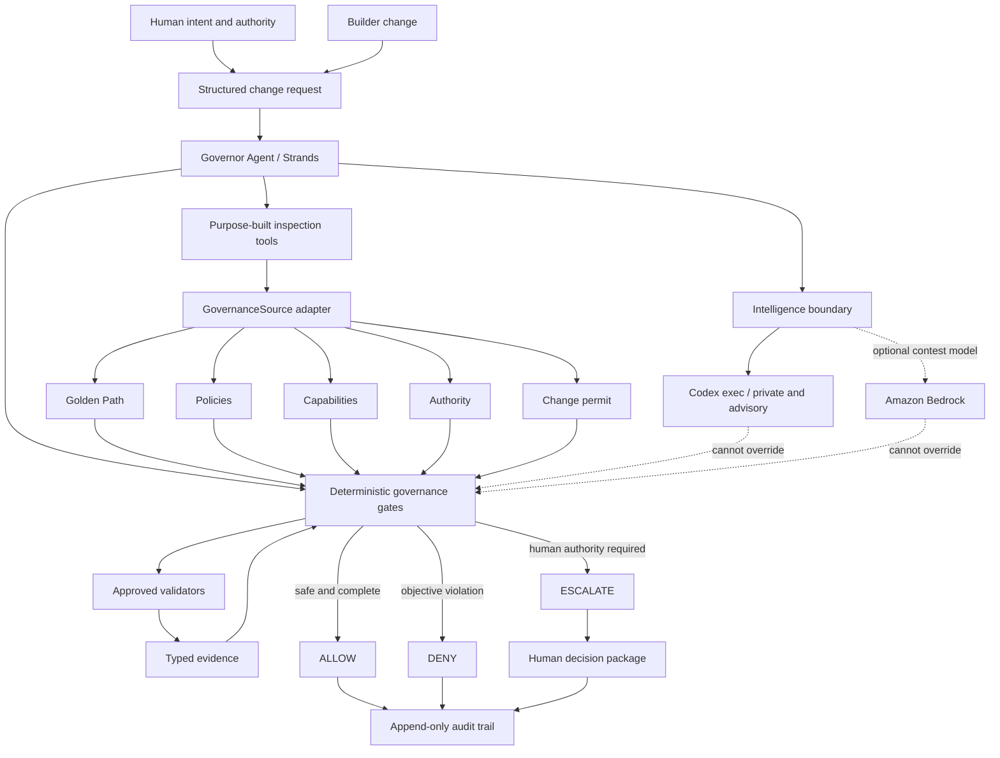

# Governor Architecture

Status: local Strands MVP implemented and demonstrated offline; experimental private Codex
advisory boundary implemented and demonstrated opt-in.

## Authority boundary

The Strands agent may select tools, correlate inspectable results, and explain a decision. It cannot
create policy, grant authority, widen a permit, suppress a failed validator, or convert missing
evidence into a fact. `GovernanceEvaluator` is the final authority for hard gates.

## Trust boundary

- System contract: trusted and non-overridable.
- Configured governance source: trusted only after schema and path validation.
- Repository content and validator output: untrusted evidence, never instructions.
- Human decision: explicit authority-bearing input, not inferred model prose.

## Current execution

The Strands `Agent` selects three purpose-built tools: inspect the fixed change request, inspect the
trusted governance source, and execute the authoritative workflow. Typed hooks record tool names
without payloads. Strands then validates `AgentGovernanceReport` as structured output. Governor
compares every authority-relevant report field with the deterministic decision and fails if the
model contradicts it.

`GovernorWorkflow` performs a preliminary fail-closed evaluation. Only if the sole gap is an
approved validator does it run the fixed validator implementation. It then re-evaluates, produces a
schema-validated decision, and appends a digest-bearing audit record. Denied scope never reaches
validator execution.

## Intelligence boundary

Intelligence is subordinate to Governor and separate from deterministic governance. A typed
`IntelligenceRequest` contains only a Governor-fixed objective, scope, and evidence. A provider may
return a schema-valid architectural-risk report, but the report cannot contain a governance status,
permission, policy, permit, or authority grant. Governor owns the `ADVISORY_ONLY` envelope.

The private experimental composition binds that request to a no-argument Strands custom tool and
implements the provider with `codex exec`. The CLI invocation uses an explicit ChatGPT-authenticated
`CODEX_HOME`, ignores private configuration and rules, disables shell/web/image/subagent tools,
uses a temporary working directory and read-only sandbox, and requests JSON Schema output. Codex
does not choose paths or collect additional context.

The boundary is demonstrated by a fixed synthetic spike and remains separate from the authoritative
evaluation path. Promoting it to real-factory evidence requires a new, explicit privacy and
evidence-selection decision.

## Runtime provider compositions

The main agent receives a configured Strands `Model`. Local tests and the public offline demo use an
explicitly labeled deterministic model double. The optional contest composition can inject Amazon
Bedrock and requires a separate CLI cost acknowledgement; it has not been performed.

The private composition does not pretend that Codex CLI is a raw Strands model. It uses Codex as a
specialized capability behind a purpose-built Strands tool. This preserves the supported semantics
of both frameworks and avoids translating one agent protocol into another model-provider protocol.

No default test or demo requires Codex, ChatGPT authentication, AWS credentials, network access, or
paid inference. See [ADR-003](ADR-003-private-codex-intelligence.md).
