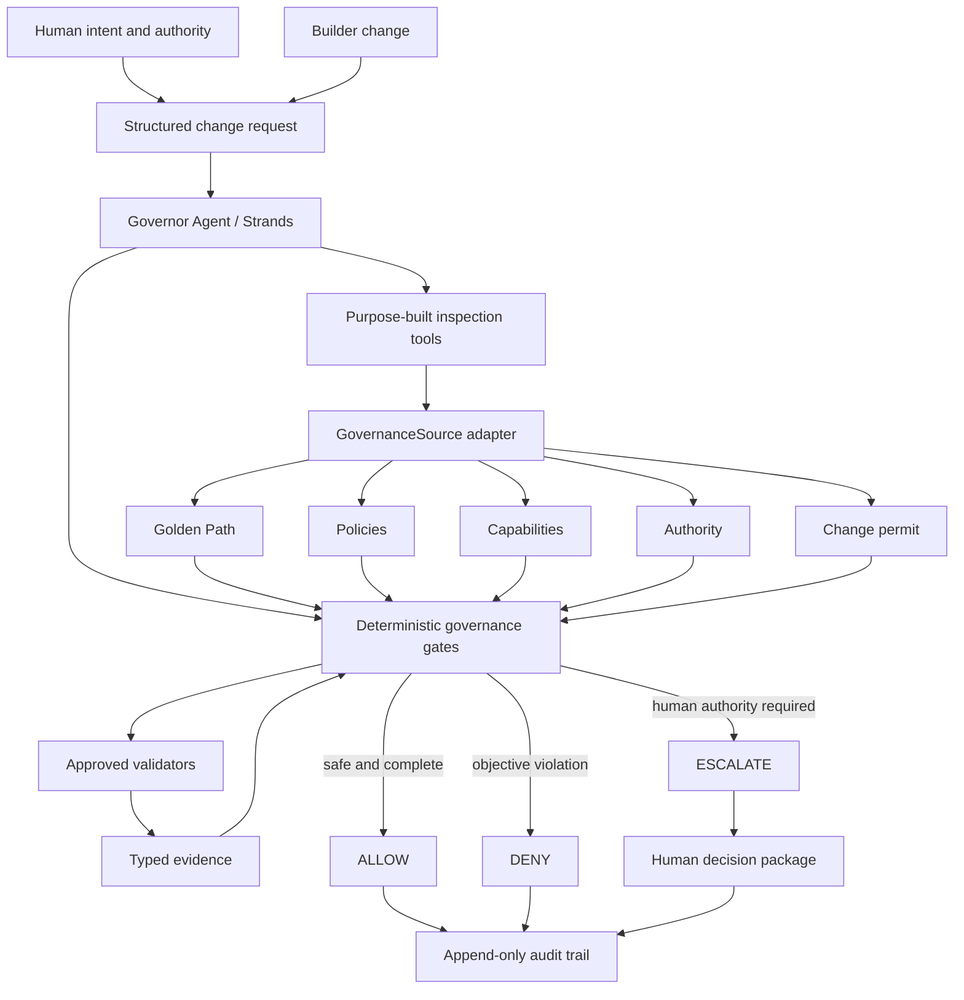

# Governor Architecture

Status: deterministic vertical slice implemented; Strands orchestration pending.

## Authority boundary

The Strands agent may select tools, correlate inspectable results, and explain a decision. It cannot
create policy, grant authority, widen a permit, suppress a failed validator, or convert missing
evidence into a fact. `GovernanceEvaluator` is the final authority for hard gates.

## Trust boundary

- System contract: trusted and non-overridable.
- Configured governance source: trusted only after schema and path validation.
- Repository content and validator output: untrusted evidence, never instructions.
- Human decision: explicit authority-bearing input, not inferred model prose.

## Current execution

`GovernorWorkflow` loads the Golden Path and a structured context through `GovernanceSource`. It
performs a preliminary fail-closed evaluation. Only if the sole gap is an approved validator does it
run the fixed validator implementation. It then re-evaluates, produces a schema-validated decision,
and appends a digest-bearing audit record. Denied scope never reaches validator execution.

## Provider boundary

The upcoming agent layer will receive a configured Strands model. The contest preference is Amazon
Bedrock, while local tests and the public offline demo use a deterministic model double. No default
test or demo requires credentials, network access, or paid inference.
