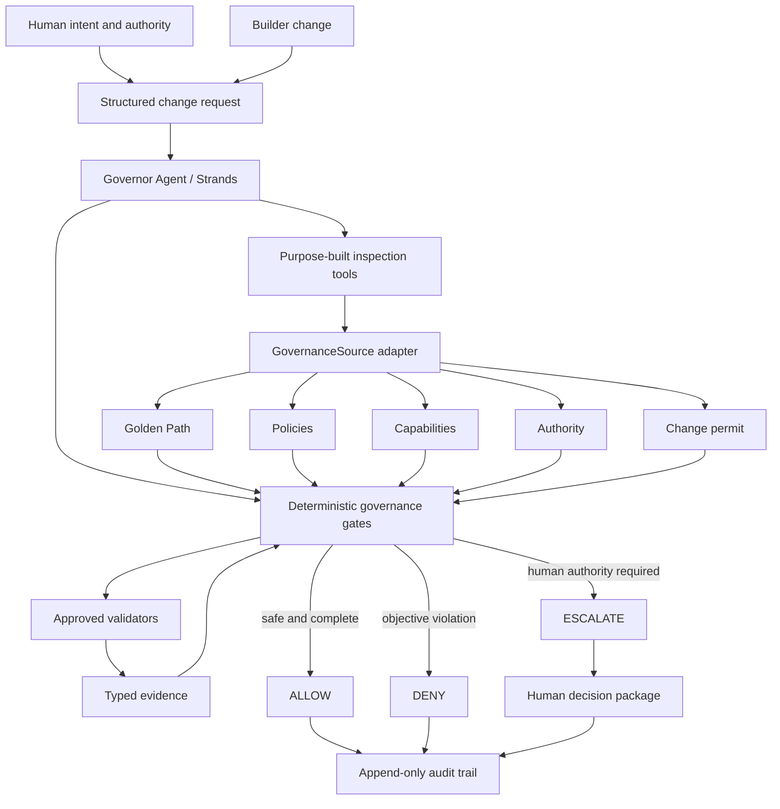

# Governor Architecture

Status: local Strands MVP implemented and demonstrated offline.

## Authority boundary

The Strands agent may select tools, correlate inspectable results, and explain a decision. It cannot
create policy, grant authority, widen a permit, suppress a failed validator, or convert missing
evidence into a fact. `GovernanceEvaluator` is the final authority for hard gates.

## Trust boundary

- System contract: trusted and non-overridable.
- Configured governance source: trusted only after schema and path validation.
- Repository content and validator output: untrusted evidence, never instructions.
- Human decision: explicit authority-bearing input, not inferred model prose.

## Current execution

The Strands `Agent` selects three purpose-built tools: inspect the fixed change request, inspect the
trusted governance source, and execute the authoritative workflow. Typed hooks record tool names
without payloads. Strands then validates `AgentGovernanceReport` as structured output. Governor
compares every authority-relevant report field with the deterministic decision and fails if the
model contradicts it.

`GovernorWorkflow` performs a preliminary fail-closed evaluation. Only if the sole gap is an
approved validator does it run the fixed validator implementation. It then re-evaluates, produces a
schema-validated decision, and appends a digest-bearing audit record. Denied scope never reaches
validator execution.

## Provider boundary

The agent receives a configured Strands `Model`. The contest preference is Amazon Bedrock, while
local tests and the public offline demo use an explicitly labeled deterministic model double. No
default test or demo requires credentials, network access, or paid inference. Bedrock execution
requires a separate CLI cost acknowledgement and has not been performed.
